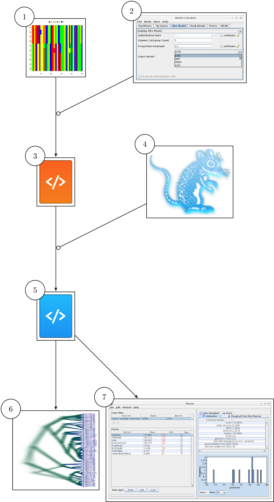

# article

The manuscript.

## How to build article

From a GNU/Linux terminal, do:

```
cd article
./create_article
```

# Figures



Workflow using GUI tools. From an alignment (1) and BEAUti (2), 
a BEAST2 configuration file (3) is created. BEAST2 (4) uses that file
to infer a posterior, storing it in multiple files (5). These results
are visualized using DensiTree (6) and Tracer (7). babette allows
for the same workflow, all from an R function call.

## Questions the article should answer

 * What is `babette`?
 * What is `babette`'s licence?
 * Who can run `babette`? 
 * Why is `babette` useful?
 * Has something similar already been done? If yes, what is novel about `babette`?
 * How to use `babette`?
 * What is a minimal example of `babette`?
 * What is a more complex example of `babette`?
 * What is an example of `babette`'s novelty?
 * How is `babette` documented?
   * How is the within-R help of `babette`?
   * How is the manual of `babette`? 
 * What is the quality of `babette`'s code?
  * Code coverage
  * Style
 * What is the future of `babette`?
