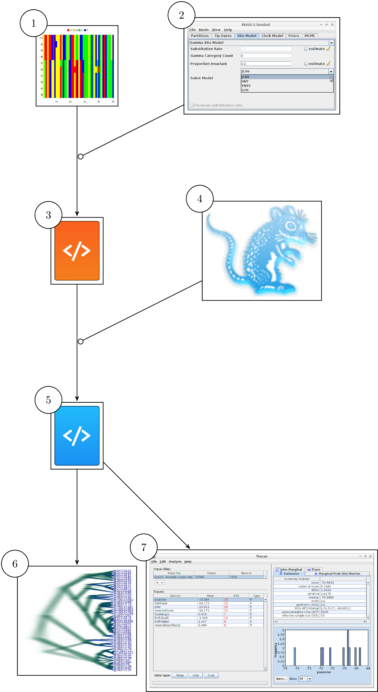

# Figures

Workflow using GUI tools. From an alignment (1) and BEAUti (2), 
a BEAST2 configuration file (3) is created. BEAST2 (4) uses that file
to infer a posterior, storing it in multiple files (5). These results
are visualized using DensiTree (6) and Tracer (7). babette allows
for the same workflow, all from an R function call.
